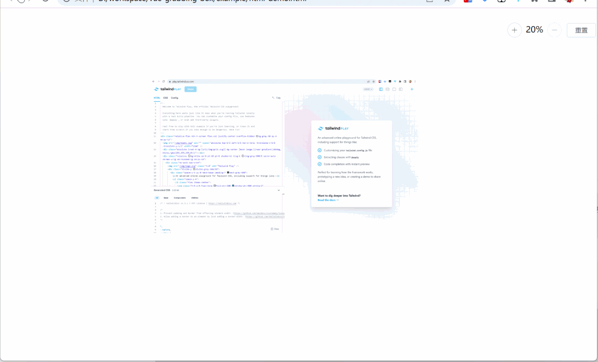

# vue-grabbing-box

[中文](README.zh-CN.md)

---

> vue3 support from `^1.0.0`

## Introdution

This is a container component (Vue component) similar to a canvas box, which displays your content (whether it is an image or any Vue component), and supports features such as:

- Mobile
  - Single finger canvas drag and drop
  - Double finger scaling (zoom-in zoom-out)
  - You can also expand, shrink, and reset by clicking the button

- PC
  - Click and hold to drag
  - Scroll wheel up and down to drag up and down
  - Scale by 'Ctrl'+'Wheel'
  - You can also zoom-in, zoom-out, and reset by clicking the button

Try it out:  
[demo-vue2](https://codermonkie.github.io/vue-grabbing-box/demo-vue2/)  
[demo-vue3](https://codermonkie.github.io/vue-grabbing-box/demo-vue3/)




## Changelog

read [changelog](./CHANGELOG.md)

## Install

```bash
pnpm add vue-grabbing-box
# or
npm install vue-grabbing-box
# or
yarn add vue-grabbing-box
```

## Usage

### Vue@2

[demo-vue2](./example/demo-vue2/)

```js
import Vue from 'vue';
import GrabbingBox from 'vue-grabbing-box'; // import as vue2 for default
// or
import GrabbingBox from 'vue-grabbing-box/dist/vue2'; // specify vue2
// recommend, in case of changing default export to vue3
import 'vue-grabbing-box/dist/vue2/index.css'; // from v0.1.0 need to import css file
Vue.use(GrabbingBox);

// or import component directly
import { GrabbingBox } from 'vue-grabbing-box/dist/vue2';
import 'vue-grabbing-box/dist/vue2/index.css';
Vue.use(GrabbingBox);
// or
Vue.component(GrabbingBox.name, GrabbingBox);
```

```vue
<template>
  <grabbing-box>
    <!-- here lays your content -->
  </grabbing-box>
</template>
```

~~*Note: used ElButton in scale button-group*~~  
(No more using ElButton from v0.1.0)

### Vue@3

```js
// for global
import { createApp } from 'vue';
import GrabbingBox from 'vue-grabbing-box/dist/vue3';
import 'vue-grabbing-box/dist/vue3/index.css';
const app = createApp();
app.use(GrabbingBox);
app.mount('#app');

// or in setup script of vue3 component
import { GrabbingBox } from 'vue-grabbing-box/dist/vue3';
```

## API

### Attributes

|Property|Type|Default Value|Note|
|--|--|--|--|
|maxScale|Number|200|max limitation, unit percent|
|minScale|Number|20|min limitation, unit percent|
|scaleStep|Number|10|unit percent|
|initScale|Number|100|unit percent, v1.0.0-alpha.4~|
|scaleButtons|Boolean|true|whether show scale button-group，includes `+` `-` and `reset`|
|scaleButtonsPosition|String|`top right`|`v0.1.1` specify the position of scale button-group, `top \| right \| bottom \| left`|
|scaleButtonsSpaceX|String|`10px`|`v0.1.1` specify the horizontal space to edge|
|scaleButtonsSpaceY|String|`20px`|`v0.1.1` specify the vertical space to edge|
|throttleSpan|Number|~~100~~ 50(from `v0.1.3`)|unit millisecond|
|~~scrollSpeed~~|Number|~~3~~ 1(from `v0.1.3`)|**deprecated from v0.1.7** `v0.0.6` mouse scroll speed，value range `1`~`6`|
|emitClickOnDrag|Boolean|false|`v0.1.4` emit click event even if have dragged (just in case of special usage case, usually could ignore this prop [#7 no-emit-click](https://github.com/CoderMonkie/vue-grabbing-box/issues/7))|

### Events（from v0.1.7）

|Event Name|Description|Params|
|--|--|--|
|update|on view change|{ scale, translateX, translateY }|
|zoom-in|on zoom in|{ scale, translateX, translateY }|
|zoom-out|on zoom out|{ scale, translateX, translateY }|
|move|on drag the cavas, or mouse scroll, or touch pad scroll|{ scale, translateX, translateY }|
|reset|on reset the view|-|

## Develop

```sh
# start demo projects(vue2 & vue3)
pnpm dev

# or start demo projects under 'expamples' folder separately
# Note that the GrabbingBox used is from NPM or local files(source files or build result)
```
