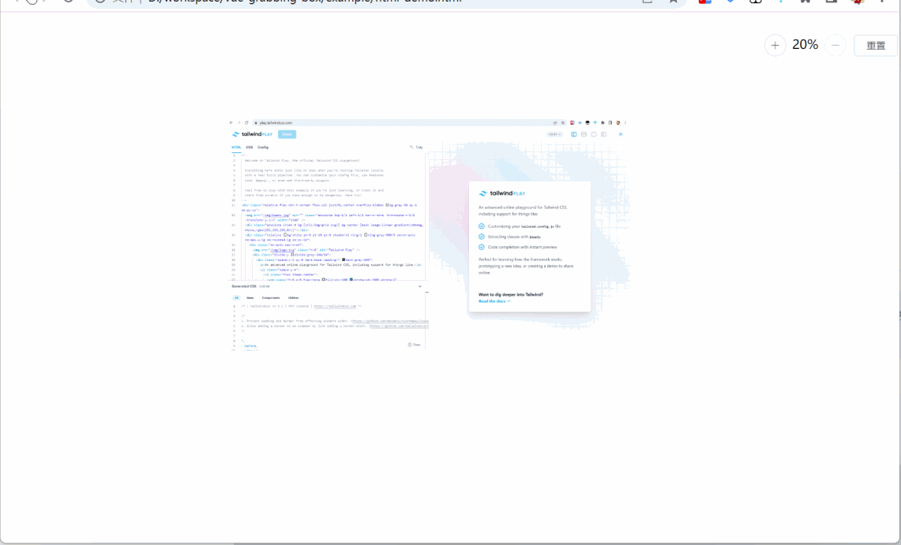

# vue-grabbing-box

[English](README.md)

---

> `^1.0.0` 起增加 vue3 版本支持

## 介绍

这是一个类似画布盒子的容器组件（vue 组件），将你的内容（无论是图片还是任何 vue 组件）展示出来，并提供：

- 移动端
  - 单指实现画布拖拽
  - 双指实现扩缩放
  - 另可通过点击按钮实现扩大缩小及重置
- PC端
  - 单击按住拖动
  - 滚动轮上下滚动 == 上下拖动
  - `Ctrl`+`Wheel`的扩缩放
  - 另可通过点击按钮实现扩大缩小及重置

直观上图：


试一下：  
[demo-vue2](https://codermonkie.github.io/vue-grabbing-box/demo-vue2/)  
[demo-vue3](https://codermonkie.github.io/vue-grabbing-box/demo-vue3/)

## 更新记录

[changelog](./CHANGELOG.md)

## 使用

### Vue@2

[demo-vue2](./example/demo-vue2/)

```bash
pnpm add vue-grabbing-box
# or
npm install vue-grabbing-box
# or
yarn add vue-grabbing-box
```

```js
import Vue from 'vue';
import GrabbingBox from 'vue-grabbing-box'; // 直接引入默认 vue2
// 或
import GrabbingBox from 'vue-grabbing-box/dist/vue2'; // 指定 vue2（推荐）
// v0.1.0起，不再将css一并打包进js文件，需要单独引入样式
import 'vue-grabbing-box/dist/vue2/index.css';

Vue.use(GrabbingBox);

// 组件级安装（局部安装）也是支持的，只是就一个组件而已，又不是组件库，就没必要了
// 而且组件单独安装必需要单独引入样式
import GrabbingBox from 'vue-grabbing-box/packages/vue2/src/grabbing-box';
import 'vue-grabbing-box/dist/vue2/index.css';
Vue.use(GrabbingBox);
// 或
Vue.component(GrabbingBox.name, GrabbingBox);
```

```vue
<template>
  <grabbing-box>
    <!-- 这里是内容区域，放你自己的内容 -->
  </grabbing-box>
</template>
```

~~*注：scale 按钮组中使用了 ElButton*~~  
v0.1.0起不再依赖 ElementUI 的 ElButton 组件

### Vue@3

```js

import { createApp } from 'vue';
import GrabbingBox from 'vue-grabbing-box/dist/vue3';
// 或
import { GrabbingBox } from 'vue-grabbing-box/dist/vue3';
import 'vue-grabbing-box/dist/vue3/index.css';

const app = createApp();
app.use(GrabbingBox);
app.mount('#app');
```

## API

### 属性参数

|属性名|类型|默认值|说明|
|--|--|--|--|
|maxScale|Number|200|放大最高比例限制，单位百分比|
|minScale|Number|20|缩小的最小比例限制，单位百分比|
|scaleStep|Number|10|放大缩小的步长，点击按钮时用，单位同上|
|initScale|Number|100|初始化时的显示比例，v1.0.0-alpha.4~|
|scaleButtons|Boolean|true|是否显示 scale 按钮组，包括放大（+）缩小（-）和重置|
|scaleButtonsPosition|String|`top right`|`v0.1.1` 指定缩放按钮组的位置, `top \| right \| bottom \| left`|
|scaleButtonsSpaceX|String|`10px`|`v0.1.1` 指定与边的横向距离|
|scaleButtonsSpaceY|String|`20px`|`v0.1.1` 指定与边的纵向距离|
|throttleSpan|Number|~~100~~ 50(from `v0.1.3`)|事件节流时间间隔，单位毫秒|
|~~scrollSpeed~~|Number|~~3~~ 1(from `v0.1.3`)|**deprecated from v0.1.7** `v0.0.6` PC端鼠标滚动轮上下滚动倍速，可设范围`1`~`6`|
|emitClickOnDrag|Boolean|false|`v0.1.4` 拖拽后仍触发点击事件 (只是为了预防有特殊需要, 通常可以忽略这个参数 [#7 屏蔽 click](https://github.com/CoderMonkie/vue-grabbing-box/issues/7))|

### 事件（from v0.1.7）


|事件名称|说明|回调参数|
|--|--|--|
|update|任何显示效果的变化都会触发（包括放大缩小拖拽和重置）|{ scale, translateX, translateY }|
|zoom-in|放大显示效果的时候触发|{ scale, translateX, translateY }|
|zoom-out|缩小显示效果的时候触发|{ scale, translateX, translateY }|
|move|改变横向或竖向位置的时候触发，也就是拖拽或者滚动轮滚动或者触摸板滚动|Object|
|reset|重置时触发|-|

## 开发

```sh
# 启动 demo 项目进行开发
pnpm dev

# 也可以进入 excamples 下的 vue2、vue3 项目单个启动
# 注意项目中对 GrabbingBox 的引入，是本地原文件或者编译后文件，还是线上 NPM 包
```
